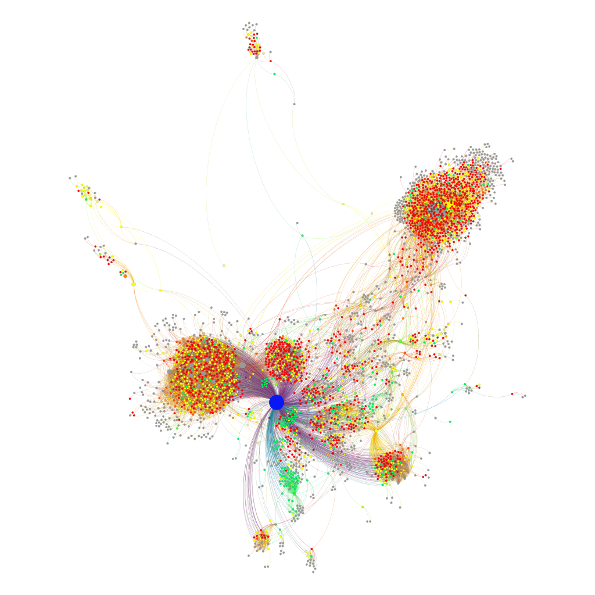
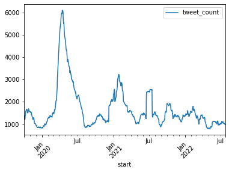
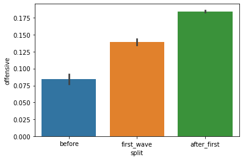

# Rally ‘round the institution:  
Sentiments and emotions toward NHS during the COVID-19 pandemic  
Political conversations on UK Twitter and their sentiments about a public institution under fire  

Anecdotal evidence: people and politicians rallied around health institutions after COVID-19 before eventually drifting apart.  
Hypothesis: we expect to observe such rallying behavior in social media discussions.  
RQ: How do discussions involving MPs on Twitter regarding NHS change after the pandemic hits?  

## Data collection & Analysis methods

- Get data of UK’s MPs affiliation and tweet handles
- Get their conversations about NHS
- 52,302 tweets collected with twarc2
- Split data: before, 1st wave, after

Text analysis:
- remove URLs
- 🤗Twitter RoBERTa models of Cardiff NLP
- sentiment, hate, offensive, emotion, irony

Network analysis:  
- using Gephi
- mention graph + sentiment
- PageRank, ForceAtlas2

## SICSS 2022 - Idea 6

Group members:
- Markus Reiter-Haas
- Abdoul kafid TOKO
- Emil Bakkensen Johansen
